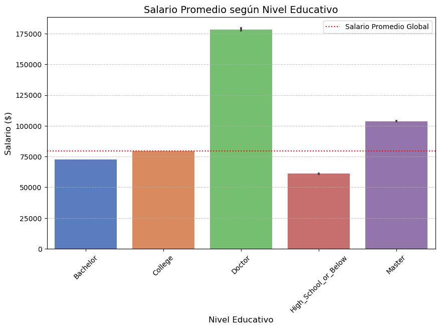
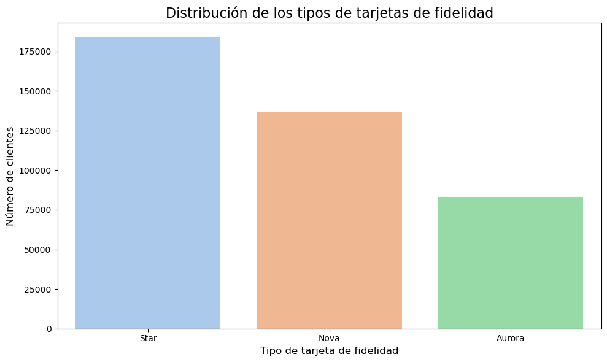
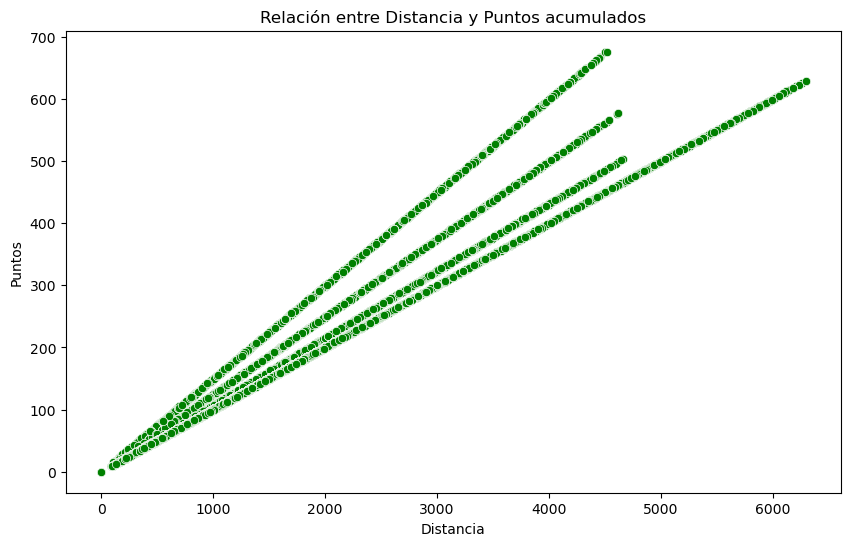
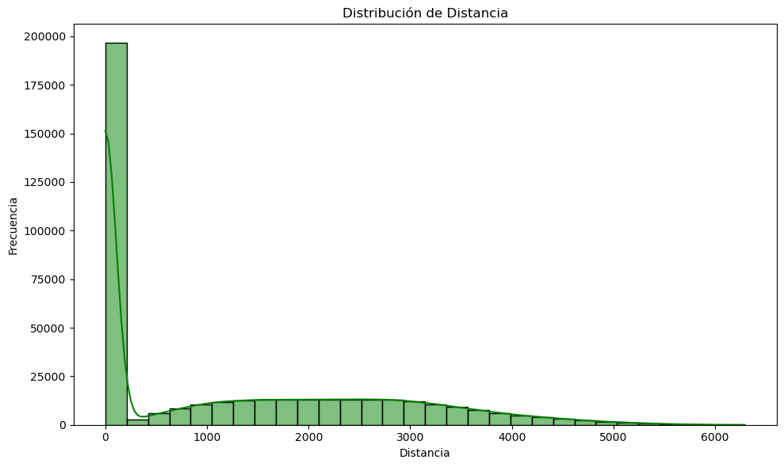
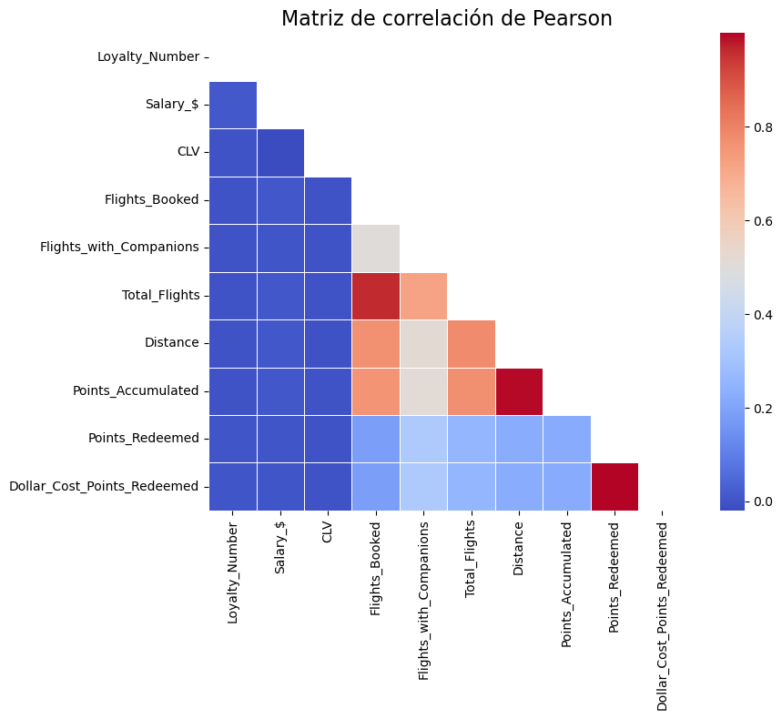

# 📊 Análisis de Datos de Clientes - Aerolínea ✈️

Este proyecto corresponde a la **Evaluación Final** del Módulo 3 de Data Analysis, donde se realiza un análisis exploratorio de los datos de los clientes de una aerolínea que participan en su programa de lealtad.

## 📝 Descripción del Proyecto

En este análisis, se exploran dos conjuntos de datos relacionados con la actividad de vuelo y el perfil de los clientes dentro de un programa de lealtad de una aerolínea. Los objetivos son realizar un análisis de los datos, visualizarlos y obtener conclusiones significativas sobre el comportamiento de los clientes.

### Archivos Utilizados:

- **Customer Flight Analysis.csv**: Contiene datos sobre la actividad de vuelo de los clientes, incluyendo los vuelos reservados, distancia volada, puntos acumulados y redimidos...

- **Customer Loyalty History.csv**: Incluye información sobre el perfil de los clientes, como ubicación, estado civil, género, educación, ingresos, tipo de tarjeta de lealtad...

## 🔍 Fases del Proyecto

### Fase 1: Exploración y Limpieza de Datos 🧹

- **Exploración Inicial**: Inspección de datos para identificar posibles problemas como valores nulos, atípicos o faltantes.

- **Limpieza de Datos**: Tratamiento de valores nulos, corrección de inconsistencias y ajustes necesarios en los datos.

### Fase 2: Visualización de Datos 📈

Se realizaron diversas visualizaciones con el fin de responder preguntas específicas sobre el comportamiento de los clientes, tales como:

- ¿Cómo se distribuye la cantidad de vuelos reservados por mes?

- ¿Existe una relación entre la distancia de los vuelos y los puntos acumulados?

- ¿Cuál es la distribución de los clientes por provincia o estado?

- ¿Cómo se compara el salario promedio entre los diferentes niveles educativos de los clientes?

- ¿Cuál es la proporción de clientes con diferentes tipos de tarjetas de fidelidad?

- ¿Cómo se distribuyen los clientes según su estado civil y género?

## 🔧 Herramientas Utilizadas

- **Python**: Para análisis y manipulación de datos.

- **Pandas**: Para la manipulación y limpieza de los datos.

- **Matplotlib & Seaborn**: Para la creación de visualizaciones y gráficos.

## 📊 Resultados

Se generaron varias visualizaciones que muestran patrones significativos entre los datos, incluyendo:

📊 Tipos de Gráficas Utilizadas

📉 Barplot

Representa valores promedios o agregados por categoría.

📦 Countplot

Muestra el conteo de observaciones en cada categoría.

🟢 Scatterplot

Muestra la relación entre dos variables numéricas.

📊 Histplot

Histograma que muestra la distribución de una variable numérica.

🔥 Heatmap

Muestra una matriz de correlación visualmente.

## 📁 Estructura de Archivos

📁 files = Archivos csv orignales, limpios y csv final. 
Además de un data set que contiene todos los datos referentes a los clientes que han causado baja en su suscripción.

📁 doumentación = Archivos en los que se recoge información relevante y descriptiva del trabajo relizado durante el estudio, la transformación y visualización de los datos.

📁 doc_trabajo = Aquí encontramos 4 archivos que se corresponden con las fases del Proyecto desarrollado:

    🔎 FASE_1 = EDA
    🔎 FASE_2 = UNION
    🔎 FASE_3 = VISUALIZACIÓN
    🔎 FASE_4 = BONUS

🚀 Next Steps

    ♻️ Mejora de la transformación de datos y revisión de duplicados para garantizar la calidad y consistencia del dataset.
    
    🔍 Análisis más profundo de clientes que cancelaron su suscripción (clientes_bajas.csv) para entender patrones y motivos.

    📈 Segmentación de clientes basada en comportamiento, tipo de tarjeta.

    📊 Visualización avanzada de correlaciones y relaciones entre variables (por ejemplo, nivel_educativo vs frecuencia de vuelos).

    📉 Uso de hipótesis en gráficas basadas en patrones observados, para validar tendencias:
    
        - Clientes con salario más alto canjean menos puntos.
        - Clientes con tarjetas de nivel superior acumulan más puntos por la misma distancia recorrida.
        - Clientes con tarjeta "Star" reservan más vuelos al mes que los de otras tarjetas.

    💡 Modelado predictivo: explorar modelos que predigan cancelaciones o valor futuro del cliente.
